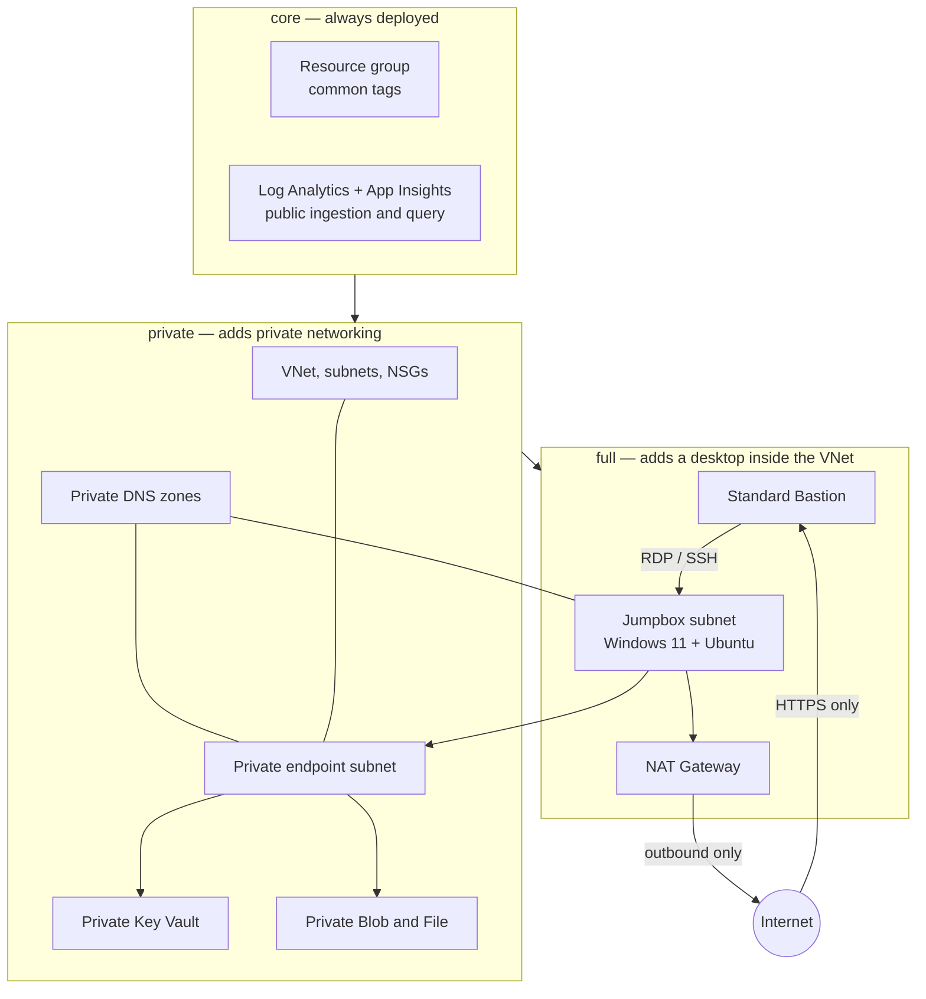

# Architecture

The template deploys at subscription scope, creates one environment resource
group, and invokes resource-group-scoped Bicep modules. Resources use
deterministic environment/region naming and common ownership and lifecycle tags.

Two layers make that work, and they are deliberately separate:

- **`infra/core/`** — the conventions layer. Naming functions, the common-tag
  function, the shared private endpoint pattern, and the abbreviation, region
  and name-rule catalogs. Present in every profile and in every project, whether
  or not it deploys a network.
- **`infra/modules/`** — the resource catalog. One self-describing folder per
  resource, each with a `metadata.json` contract. See
  [the module catalog](modules.md).

`infra/main.bicep` is the only file that changes per project: it resolves the
profile, composes names from `infra/core/naming.bicep`, and invokes the modules
the project has opted into.

## Deployment profiles

`core` deploys the resource group, tags and monitoring, and nothing else. It
creates no virtual network, no private endpoints and no private DNS, and it does
not force Key Vault or Storage on a project — those are catalog modules a
project opts into. `core/private-endpoint.bicep` is simply never invoked.

`private` adds the network, private DNS, and a private Key Vault and Storage
account. `full` adds both VMs, Bastion, NAT, Entra login extensions, RBAC
assignments, and shutdown schedules. `minimal` is a deprecated alias for
`private`. See [configuration](configuration.md) for the feature dependency
rules.

The profile ladder is proven rather than asserted: `tests/bicep.tests.ps1`
evaluates the compiled ARM template for each profile and fails if `core` ever
produces a `Microsoft.Network` or `Microsoft.Compute` resource.

## Network

The `private` and `full` profiles use a default `10.42.0.0/22` VNet, which
reserves:

| Subnet | Default prefix | Purpose |
|---|---|---|
| `AzureBastionSubnet` | `10.42.0.0/26` | Standard Bastion |
| `snet-jumpboxes` | `10.42.0.64/26` | Windows and Ubuntu VMs |
| `snet-private-endpoints` | `10.42.0.128/27` | Key Vault and Storage |

## Naming contract

Resource names are composed by the `@export()`ed functions in
`infra/core/naming.bicep` from the AZD environment, the approved region code in
`infra/core/location-codes.json`, the cached subscription code, and
`infra/core/abbreviations.json`. `infra/main.bicep` imports those functions; it
does not reimplement them. The standard order is
`<resource-prefix>-<location-code>-<subscription-code>-<environment>`.

Because Bicep user-defined functions may not call `subscription()`, the caller
resolves the uniqueness suffix and the location code and passes them in. Every
name in the template is produced by one of three functions:

| Function | Produces |
|---|---|
| `baseName` | The shared `<location-code>-<subscription-code>-<environment>` base |
| `azName` | A standard hyphenated resource name, optionally with a purpose segment |
| `globalName` | A globally unique, length-capped name that truncates only the environment segment |

`infra/core/name-rules.json` records the length, charset, case and scope
constraints of each resource type, and `tests/naming.tests.ps1` asserts every
rendered name obeys them.

| Resource | Prefix | Constraint handling |
|---|---|---|
| Resource group | `rg-` | Standard segment order; maximum 90 characters |
| Application Insights | `appins-` | Standard segment order |
| Log Analytics workspace | `law-` | Standard segment order; maximum 63 characters |
| Private endpoint | `pe-` | Standard segment order plus `kv`, `blob`, or `file` purpose |
| Private endpoint NIC | `pe-nic-` | Explicit `customNetworkInterfaceName`; standard order plus purpose; maximum 80 characters |
| Virtual network | `vnet-` | Standard segment order; maximum 64 characters |
| Subnet | `snet-` | Standard order plus purpose; Bastion keeps reserved `AzureBastionSubnet` |
| Network security group | `nsg-` | Standard order plus subnet purpose |
| Public IP | `pip-` | Standard order plus `bastion` or `nat` purpose |
| Azure Bastion | `bast-` | Standard segment order |
| NAT Gateway | `natgw-` | Standard segment order |
| Windows VM | `vm-win-` | Standard segment order; guest hostname is separately capped at 15 characters |
| Linux VM | `vm-lin-` | Standard segment order; maximum 64 characters |
| VM NIC | `nic-` | Standard order plus `win` or `lin` purpose |
| Storage account | `stacct` | Separators removed; lowercase alphanumeric; environment truncated; three-character hash retained; maximum 24 characters |
| Key Vault | `kv-` | Environment truncated; three-character hash retained; maximum 24 characters |

For example, East US 2, subscription
`ME-MngEnvMCAP391575-emberger-1`, and AZD environment `poc` produce the common
base `use2-s1-poc`. East US 2 maps to `use2`; West US 3 maps to `usw3`; Canada
Central maps to `cac`.

The location catalog covers approved Azure public-cloud regions. Codes are
lowercase, country-first, unique, and stable after publication. Preflight fails
closed when a location is not mapped. Add new Azure regions to the shared JSON
catalog only after reviewing the proposed code for collisions; do not change a
published code for an existing region.

The subscription code is `s` plus the final hyphen-delimited 1-4 digit token in
the active subscription display name. It is cached in the AZD environment on
first initialization and verified on every preflight. A subscription rename
that changes the derived code blocks provisioning so it cannot silently change
resource identities.

Storage and Key Vault use a stable three-character uniqueness suffix derived
from the subscription ID, complete environment name, and canonical region.
Truncating their displayed environment segment therefore does not truncate the
hash inputs. Because three characters provide a deliberately small uniqueness
space, always inspect preview for a global-name collision before deployment.

The Windows Azure VM resource name follows the standard order. Its guest
hostname is independently derived as `w-<compact-environment>-<hash>` so the
resource name can stay descriptive without violating the 15-character Windows
computer-name limit.

Names are a stable contract. `tests/naming.tests.ps1` renders the full name set
from the compiled ARM template and compares it against a recorded baseline, so
any change that would replace a deployed resource fails the suite rather than
surfacing in a provision preview.

## Deliberate public exceptions

- Standard Bastion owns the only default inbound public IP. VM NICs have none,
  and RDP/SSH is accepted only from `AzureBastionSubnet`.
- Full-profile NAT owns an outbound-only public IP. It cannot accept unsolicited
  inbound connections.
- Azure Monitor public ingestion and query remain enabled so Log Analytics and
  Application Insights work without a private-link scope. Local authentication
  stays disabled.

These exceptions are intentional, not permission to add public workload
endpoints. See [security](security.md).

## Extension points

- Add a resource by wiring in a catalog module with `./scripts/add-module.ps1`,
  or author a new one with `./scripts/new-module.ps1`. A module declares its
  providers, profiles, private endpoints and roles in `metadata.json`, and
  preflight and the private DNS zone list derive from that declaration.
- A module that supports Private Link takes `privateEndpointSubnetId` and
  `privateDnsZoneId`. Leave both empty and it deploys public-with-firewall; set
  them and it calls `infra/core/private-endpoint.bicep`. One module body
  therefore serves `core`, `private` and `full` alike. Do not expose service
  public endpoints as a shortcut in a private profile.
- Add PoC workload subnets from the unallocated VNet range; give each an NSG and
  explicit egress policy.
- Add deployable services to `azure.yaml` only when application source exists.
- Add module outputs only for downstream composition; never output credentials,
  keys, connection strings, or secret values.
- Extend `infra/main.parameters.json` when exposing a new Bicep parameter
  through `azd`, and add preflight dependency checks and documentation in the
  same change.

Preserve subscription-scope orchestration, modular Bicep, profile behavior, the
`infra/core/` conventions layer, and the
`azure-prepare → azure-validate → azure-deploy` gates.
