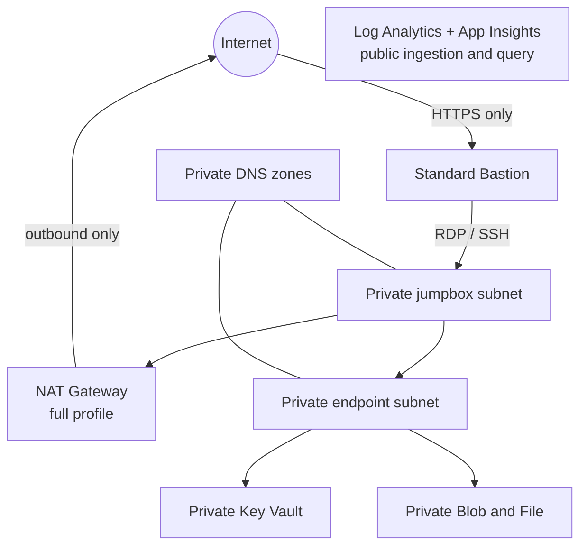

# Architecture

The template deploys at subscription scope, creates one environment resource
group, and invokes resource-group-scoped Bicep modules. Resources use
deterministic environment/region naming and common ownership and lifecycle tags.

## Network and profiles

The default `10.42.0.0/22` VNet reserves:

| Subnet | Default prefix | Purpose |
|---|---|---|
| `AzureBastionSubnet` | `10.42.0.0/26` | Standard Bastion |
| `snet-jumpboxes` | `10.42.0.64/26` | Windows and Ubuntu VMs |
| `snet-private-endpoints` | `10.42.0.128/27` | Key Vault and Storage |

`minimal` creates the network, private Key Vault and Storage, and monitoring.
`full` additionally creates both VMs, Bastion, NAT, Entra login extensions,
RBAC assignments, and shutdown schedules. See
[configuration](configuration.md) for dependencies.

## Naming contract

Resource names are derived centrally in `infra/main.bicep` from the AZD
environment, region, and `infra/abbreviations.json`.

| Resource | Prefix | Constraint handling |
|---|---|---|
| Resource group | `rg-` | Environment and region; maximum 90 characters |
| Application Insights | `appins-` | Environment and deterministic regional suffix |
| Log Analytics workspace | `law-` | Environment and deterministic regional suffix; maximum 63 characters |
| Private endpoint | `pe-` | Service-specific suffix such as `blob` or `file` |
| Private endpoint NIC | `pe-nic-` | Explicit `customNetworkInterfaceName`; maximum 80 characters |
| Virtual network | `vnet-` | Environment and deterministic regional suffix; maximum 64 characters |
| Subnet | `snet-` | Purpose suffix; Bastion must use reserved `AzureBastionSubnet` |
| Network security group | `nsg-` | VNet and subnet purpose |
| Azure Bastion | `bast-` | Environment and deterministic regional suffix |
| NAT Gateway | `natgw-` | Environment and deterministic regional suffix |
| Windows VM | `vm-win-` | Compact environment segment and three-character suffix; maximum 15 characters |
| Linux VM | `vm-lin-` | Environment and deterministic regional suffix; maximum 64 characters |
| Storage account | `stacct` | Lowercase alphanumeric only; maximum 24 characters |
| Key Vault | `kv-` | Lowercase alphanumeric and hyphens; maximum 24 characters |

Storage and Key Vault use a stable three-character uniqueness suffix derived
from the subscription, environment, and region. This behaves like randomized
uniqueness across environments while remaining idempotent on every
redeployment. Because three characters provide a deliberately small uniqueness
space, always inspect preview for a global-name collision before deployment.

## Deliberate public exceptions

- Standard Bastion owns the only default inbound public IP. VM NICs have none,
  and RDP/SSH is accepted only from `AzureBastionSubnet`.
- Full-profile NAT owns an outbound-only public IP. It cannot accept unsolicited
  inbound connections.
- Azure Monitor public ingestion and query remain enabled so Log Analytics and
  Application Insights work without a private-link scope. Local authentication
  stays disabled.

These exceptions are intentional, not permission to add public workload
endpoints. See [security](security.md).

## Extension points

- Add PoC workload subnets from the unallocated VNet range; give each an NSG and
  explicit egress policy.
- Add private endpoints and their documented Private DNS zones through the
  network/DNS modules. Do not expose service public endpoints as a shortcut.
- Add deployable services to `azure.yaml` only when application source exists.
- Add module outputs only for downstream composition; never output credentials,
  keys, connection strings, or secret values.
- Extend `infra/main.parameters.json` when exposing a new Bicep parameter
  through `azd`, and add preflight dependency checks and documentation in the
  same change.

Preserve subscription-scope orchestration, modular Bicep, profile behavior, and
the `azure-prepare → azure-validate → azure-deploy` gates.
